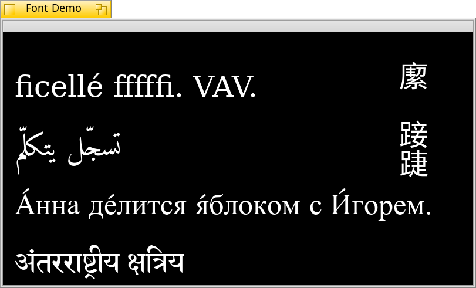

Harfbuzz Application for Haiku
===========

Harfbuzz Application for Haiku that renders text using the Harfbuzz Lib and libfreetype.
This application is made for Haiku as a part of my GSoC 2017 proposal.

How to run on Haiku?
-------
I am assuming you have the harfbuzz_develop package installed. If not please install it through HaikuPorter, then run the following commands through Terminal.

--> git clone https://github.com/digib0y/DemoHarfbuzzApp.git
--> setarch x86
--> make
--> objects.x86-cc5-release/HarfbuzzDemo

and you will have the application running :)

License
-------

It is released under the MIT licence.

Greetings
---------

To stippi and pulkomandy for helping me develop this application.
To the GSoC program for being there.
To the Haiku project for being there.